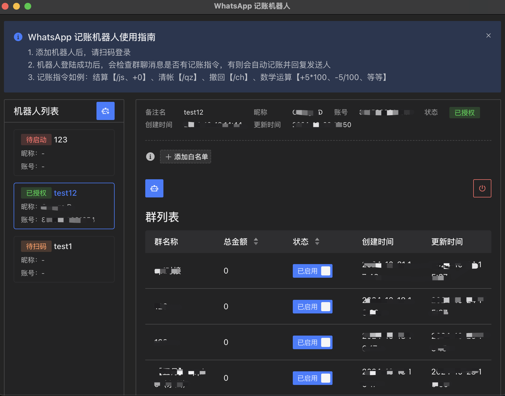

# WhatsApp 群记账机器人

- 该项目用于在 `WhatsApp` 群中记录账单。
- 该项目基于 `Vite` 和 `Electron` 构建。

## 项目说明

- 该项目使用 `Prisma` 作为数据库 ORM，并使用 `sqlite` 作为数据库。
- 该项目使用 `Electron` 作为桌面应用框架。
- 该项目使用 `Vite` 作为前端构建工具。
- 该项目使用 `TypeScript` 作为开发语言。

## 启动项目

- 安装依赖

```bash
yarn install
```

- 首次启动项目，需要先初始化数据库，并生成 `Prisma Client`

```bash
yarn prisma migrate dev
```

- 启动项目

```bash
yarn dev
```

## 打包项目

- 编译安装包

```bash
yarn build
```

## 操作说明



### 上方

- 展示提示信息，可以关闭

### 左侧

- 展示机器人列表，可以添加机器人和选中机器人

### 右侧

- 展示机器人操作面板，可以添加白名单和查询账单
- 可以启动或销毁机器人网页
